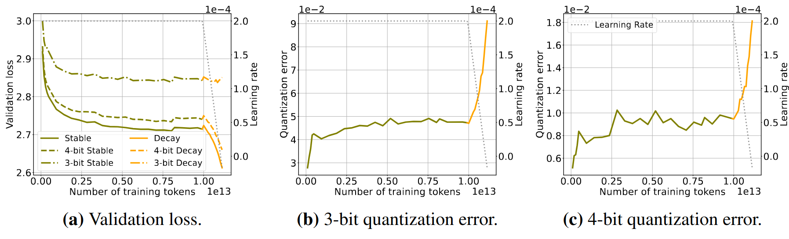
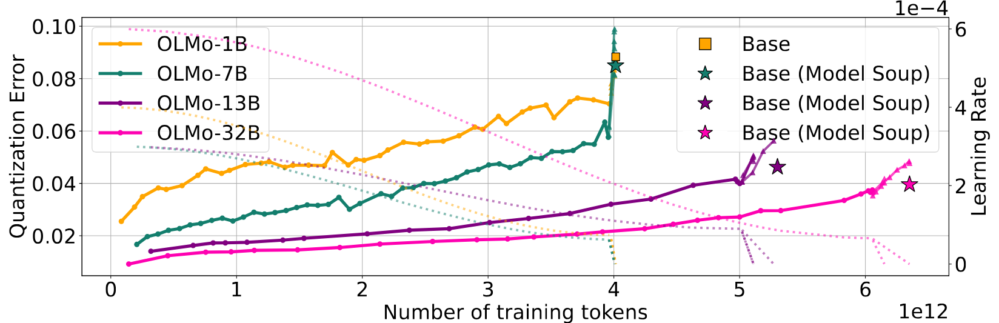
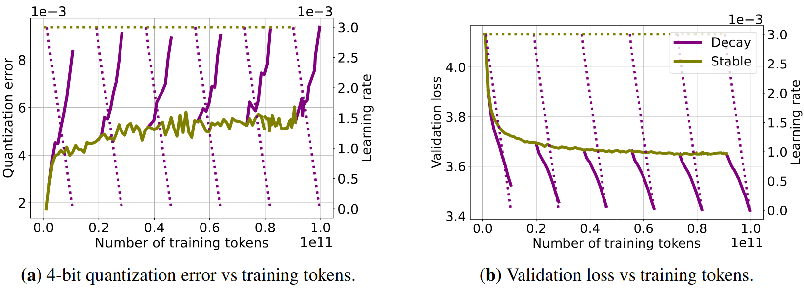
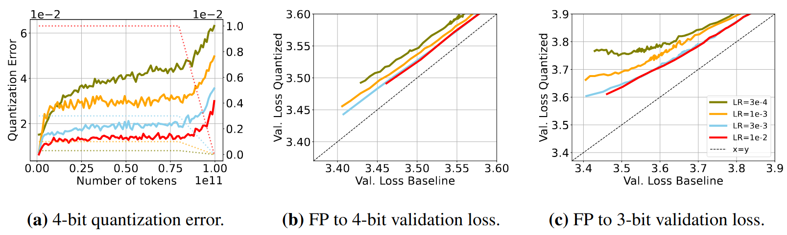
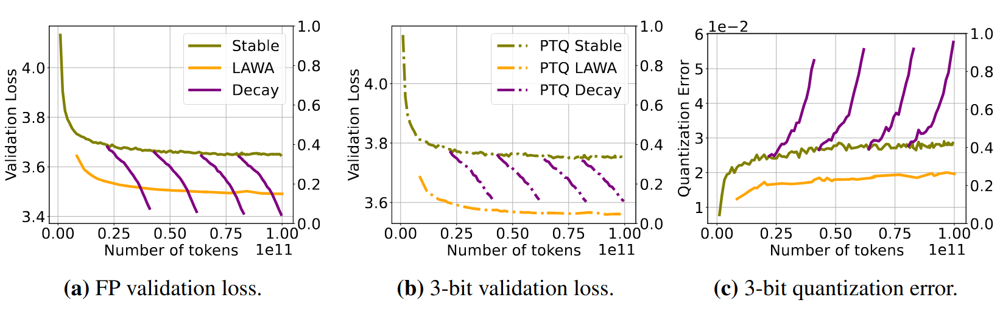
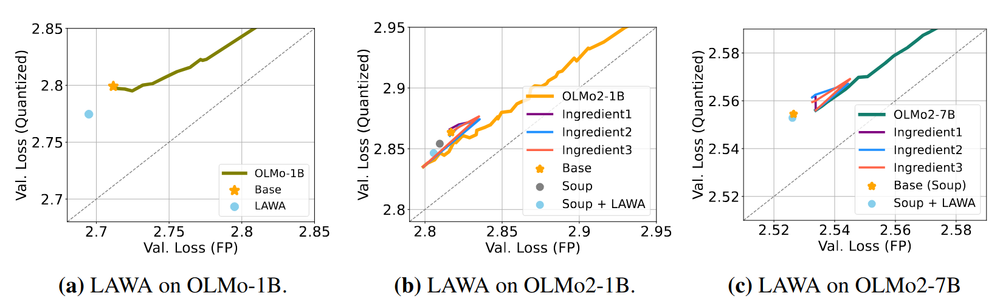

# Training Dynamics Impact Post-Training Quantization Robustness

[[arxiv](http://arxiv.org/abs/2510.06213)]

While post-training quantization is widely adopted for efficient deployment of large language models, the mechanisms underlying quantization robustness remain unclear. We conduct a comprehensive analysis of quantization degradation across open-source language model training trajectories up to 32B parameters and 15T training tokens to accurately assess the relationship between training dynamics and quantization performance. Our key finding is that quantization errors in large-scale training runs are driven by a complex interplay between learning rate and other training hyperparameters. Specifically, once learning rates decay, validation loss and quantization error diverge, largely independent of training data scale. To investigate interventions on the training dynamics and identify specific configurations that can modulate quantization robustness favorably, we train our own models in controlled experiments up to 100B tokens. Our results challenge the assumption that increasing dataset scale inherently compromises quantization effectiveness, demonstrating instead that strategic training hyperparameter interventions can improve quantization quality at scale.

------

## Findings

##### 1. Quantization performance of open-sourced models is affected by their training dynamics.





##### 2. Learning rate decay triggers quantization error mostly independent of the number of training tokens 



##### 3. Learning rate magnitude affects quantization performance more than number of training tokens



##### 4. Different weight averaging schemes: model souping across multiple ingredients and weight averaging (along a training trajectory) promote robustness to quantization.





Captions, details and explanations on the arxiv.

## Code

This repository contains the code to replicate the quantization of the online trajectories.

All of the heavy lifting is done by 3rd party libraries, the only interest of this repository is for replicability in the config files.

Which can be found in:

```bash
config/
```

Warning: paths, wandb project... have to be edited before usage.

To quantize a checkpoint from HF run:

```python
python gptqmodel_quantize.py --config config/gptq/quantize_olmo2_1B.yaml --job_idx 0
```

To perform weight averaging and quantize the averaged weights run:

```python
python weight_averaging.py --config config/lawa/quantize_olmo2_1B_time --job_idx 0
```

To evaluate on downstream tasks run:

```python
python vllm_tasks.py --config config/gptq/quantize_olmo2_1B.yaml --job_idx 0
```

Warning1: VLLM does not work great with SmolLM3 because of the lack of a main branch in the hf repo. Downloading model checkpoints to your local filesystem will save a lot of pain.

Warning2: I have uploaded the downstream task evaluation code to provide the config hyperparameters, the code itself is a basic call to the vllm engine, not thoroughly tested for all the model families.

Warning3: Different model families have different dependencies e.g. **open-science** requires transformers 5.33, **apertus** requires the latest... This codebase tries to juggle different dependencies, you would probably be better off1 with your own calls to these 3rd party libraries by yourself.

We used [https://github.com/Niccolo-Ajroldi/plainLM/](https://github.com/Niccolo-Ajroldi/plainLM/) to pretrain pythia backbones on 10 billion tokens to 100 billion tokens.

**Installation:** Some dependencies have to be handled with extra care `lm_eval`, and some are not particularly stable `gptqmodel`. This should install the easier dependencies though.

```bash
uv venv --python $(cat .python-version)
source .venv/bin/activate
uv sync
```

## Cite

```bash
@misc{catalantatjer2025trainingdynamicsimpactposttraining,
      title={Training Dynamics Impact Post-Training Quantization Robustness}, 
      author={Albert Catalan-Tatjer and Niccolò Ajroldi and Jonas Geiping},
      year={2025},
      eprint={2510.06213},
      archivePrefix={arXiv},
      primaryClass={cs.LG},
      url={https://arxiv.org/abs/2510.06213}, 
}
```


